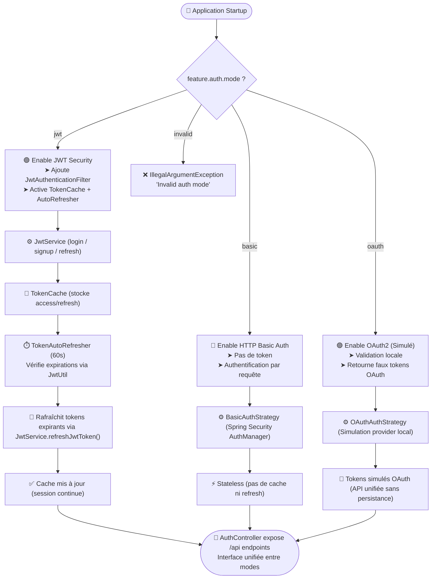
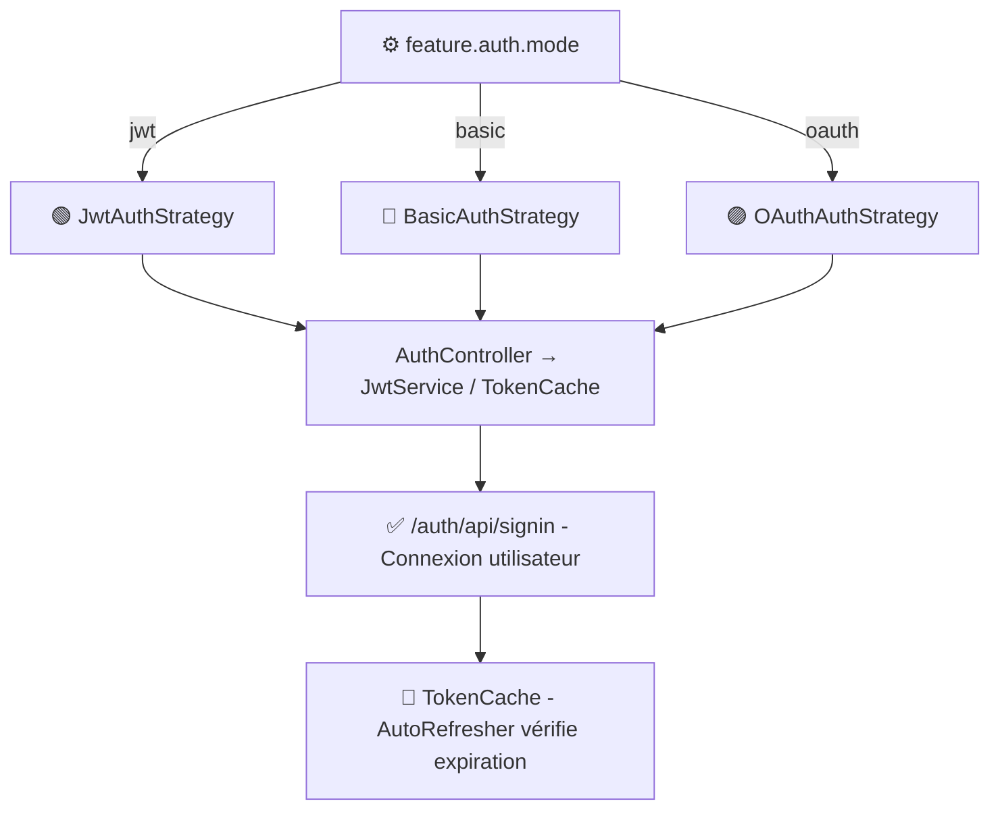
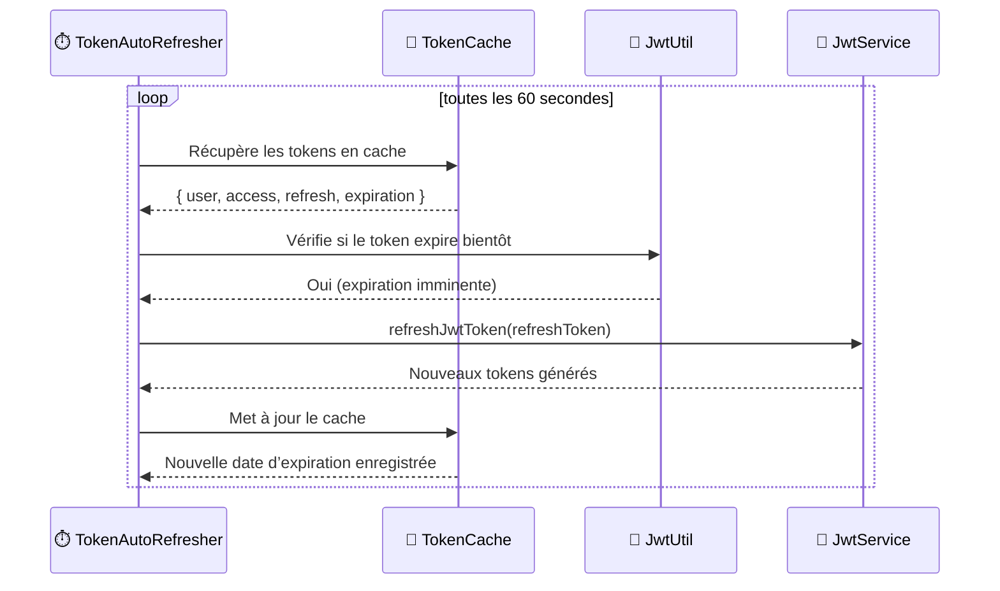

# 🔐 Auth Module – Overview & Architecture

Le module **`auth/`** fournit un **mécanisme d’authentification unifié et flexible** pour l’écosystème microservices.  
Grâce à un **feature flag** (`feature.auth.mode`), l’application peut basculer dynamiquement entre trois modes :

- 🟢 **JWT Security** — Authentification par token signé.
- 🔵 **Basic Auth** — Authentification stateless classique (HTTP Basic).
- 🟣 **OAuth2 (Simulé)** — Validation locale d’identifiants + génération de tokens mockés.

---

## ⚙️ Architecture générale (Feature Flag)



---

## 🧭 Choix de la stratégie d’authentification



### 🔑 Détails
| Mode | Description | Avantages | Limites |
|------|--------------|------------|----------|
| 🟢 **JWT** | Authentification par token signé + refresh automatique. | Sécurité élevée, sessions prolongées, interopérable entre microservices. | Nécessite gestion du cache & refresh. |
| 🔵 **Basic** | Auth classique HTTP sans token. | Simplicité, sans état. | Moins performant (auth à chaque requête). |
| 🟣 **OAuth2 (simulé)** | Génère localement des tokens mockés pour tests. | Compatible API OAuth sans dépendance externe. | Ne gère pas la révocation réelle des tokens. |

---

## 🔄 Mécanisme d’auto-refresh (JWT Mode)



### ⚙️ Étapes de fonctionnement
1. **⏱️ `TokenAutoRefresher`** s’exécute toutes les 60 secondes.
2. Il récupère les sessions stockées dans le **`TokenCache`**.
3. Pour chaque entrée, il vérifie via **`JwtUtil.isExpiringSoon()`** si le token approche de son expiration.
4. Si oui → il invoque **`JwtService.refreshJwtToken()`** pour régénérer un couple `(access, refresh)`.
5. Le cache est mis à jour, maintenant la session utilisateur active sans reconnexion.

---

## 🧩 Composants principaux

| Composant | Rôle |
|------------|------|
| **`AuthController`** | Expose `/signin`, `/signup`, `/refresh`, `/logout`. |
| **`JwtService`** | Gère la génération, validation et renouvellement des JWT. |
| **`TokenCache`** | Stocke temporairement les tokens et métadonnées (expiration, user). |
| **`TokenAutoRefresher`** | Cron (scheduler) qui surveille et rafraîchit les tokens expirants. |
| **`JwtUtil`** | Fournit les fonctions de parsing, validation et date d’expiration des tokens. |
| **`AuthStrategyFactory`** | Choisit dynamiquement la stratégie d’authentification selon le flag. |

---

## 🧠 Exemple de configuration (application.yml)

```yaml
feature:
  auth:
    mode: jwt   # options: jwt | basic | oauth

taf:
  app:
    jwtSecret: mySecretKey123
    jwtExpirationMs: 600000
```

---

## 🧪 Exemple d’utilisation API

### ✅ Connexion (JWT mode)
**POST** `/auth/api/signin`
```json
{
  "username": "alice",
  "password": "password123"
}
```

**Response**
```json
{
  "accessToken": "eyJhbGciOiJIUzI1NiIsInR5cCI6IkpXVCJ9...",
  "refreshToken": "eyJhbGciOiJIUzI1NiIsInR5cCI6IkpXVCJ9...",
  "expiresIn": 600
}
```

---

## 🧩 Résumé des avantages

- 🔄 **Flexible** : Basculer entre plusieurs modes d’auth via feature flag.
- 🧩 **Modulaire** : Chaque stratégie implémente une interface commune.
- ⏱️ **Sécurisé & Durable** : Auto-refresh automatisé via scheduler.
- 🚀 **Unifié** : AuthController unique → API identique peu importe le mode.

---

## 🧰 Pour aller plus loin
- 🔍 **Ajout futur** : intégration OAuth2 réelle (Google, Keycloak).
- 🧾 **Audit Logging** : journaliser les rafraîchissements et connexions.
- 🔐 **Blacklist Tokens** : gestion de révocation côté serveur.
- 📈 **Metrics** : exposer les compteurs via Micrometer (`@Counted`, `@Timed`).  
