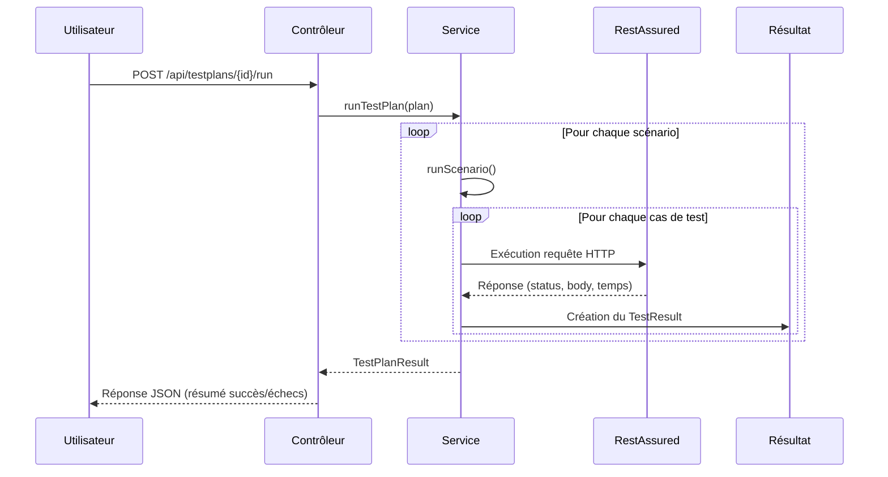

# 🧪 API de Tests RestAssured

Une plateforme légère de **gestion et d’exécution de tests API** développée avec **Spring Boot** et **RestAssured**.  
Elle permet de définir des **plans de test**, des **scénarios de test** et des **cas de test**, puis de les exécuter dynamiquement via des points d’accès REST.  
Les résultats produits contiennent les **codes d’état**, les **temps de réponse** et les **indicateurs de réussite/échec**.

---

## 🚀 Fonctionnalités

✅ Gestion des entités de test :
- **Plans de test** → Regroupement de scénarios liés
- **Scénarios de test** → Groupes logiques de cas (ex. “Flux d’authentification”)
- **Cas de test** → Requêtes REST individuelles (méthode, endpoint, corps, statut attendu)

✅ Exécution automatisée :
- Utilise **RestAssured** pour envoyer les requêtes HTTP
- Supporte `GET`, `POST`, `PUT`, `DELETE`
- Compare les statuts attendus et réels

✅ Données de démonstration intégrées :
- 4 plans de test par défaut : Auth, Utilisateur, Commande, Régression complète
- Exécution immédiate via `/api/testplans/1/run`

✅ Documentation interactive :
- Interface **Swagger / OpenAPI 3.0** intégrée
- Regroupement des endpoints par catégorie (Plans, Scénarios, Cas)

---

## 🧩 Architecture Générale

### Vue d’ensemble
```
Utilisateur → TestPlanController → TestRunnerService → RestAssured → Résultats
```

### Relations entre objets
```
TestPlan (1) → TestScenario (n)
TestScenario (1) → TestCase (n)
TestCase (1) → TestResult (1)
```

### Structure des packages
```
restAssuredTesting/
 ├── model/         → Entités (TestPlan, TestScenario, TestCase, Results)
 ├── service/       → Logique & exécution (TestPlanService, TestRunnerService)
 ├── requests/      → Contrôleurs REST (Plan, Scénario, Cas)
 ├── config/        → Configuration Swagger/OpenAPI
 └── DemoDataInitializer.java
```

---

## 📊 Diagramme de Séquence – Exécution Globale


### Explication
| Étape                             | Description                                                                                      |
| --------------------------------- | ------------------------------------------------------------------------------------------------ |
| **1. Requête utilisateur**        | L’utilisateur (via Swagger, Postman ou UI) appelle `POST /api/testplans/1/run`.                  |
| **2. Récupération du plan**       | `TestPlanController` utilise `TestPlanService` pour charger le plan depuis la mémoire (ou base). |
| **3. Exécution du plan**          | Le contrôleur transmet le `TestPlan` à `TestRunnerService.runTestPlan()`.                        |
| **4. Boucle sur les scénarios**   | `TestRunnerService` parcourt chaque `TestScenario` du plan.                                      |
| **5. Boucle sur les cas de test** | Pour chaque `TestCase`, il exécute `runCase()`.                                                  |
| **6. Exécution HTTP réelle**      | `RestAssured` envoie la requête REST (ex: `POST /auth/login`) et renvoie le `Response`.          |
| **7. Comparaison et validation**  | `TestRunnerService` compare `expectedStatus` et `actualStatus` → crée un `TestResult`.           |
| **8. Construction du rapport**    | Après tous les cas → création d’un `TestScenarioResult`, puis d’un `TestPlanResult`.             |
| **9. Retour du résultat**         | `TestPlanController` renvoie au client un JSON hiérarchique des résultats.                       |

---

## ⚙️ Installation et Configuration

### Prérequis
- Java 17+
- Maven 3.8+
- Spring Boot 3.3+
- Optionnel : Docker (pour l’API testée)

### Cloner le projet
```bash
git clone https://github.com/<votre-org>/restassured-testing-api.git
cd restassured-testing-api
```

### Compilation et exécution
```bash
mvn clean spring-boot:run
```

---

## 🌐 Swagger / OpenAPI

Une fois l’application démarrée :
- **Swagger UI :** [http://localhost:8080/swagger-ui.html](http://localhost:8080/swagger-ui.html)
- **Spécification OpenAPI JSON :** [http://localhost:8080/v3/api-docs](http://localhost:8080/v3/api-docs)

### Groupes de contrôleurs :
| Contrôleur | Tag Swagger | Chemin |
|-------------|-------------|--------|
| `TestPlanController` | 🧩 **Plans de test** | `/api/testplans` |
| `TestScenarioController` | 🧠 **Scénarios de test** | `/api/testscenarios` |
| `TestCaseController` | ⚙️ **Cas de test** | `/api/testcases` |

---

## 🧠 Exemple d’Exécution

Exécuter le plan de test par défaut :

```bash
curl -X POST http://localhost:8080/api/testplans/1/run
```

✅ Résultat :

```json
{
  "planName": "Plan de Régression Complète",
  "totalScenarios": 4,
  "totalCases": 18,
  "passed": 17,
  "failed": 1
}
```

---

## 🧰 Stack Technique

| Couche | Technologie |
|--------|--------------|
| **Langage** | Java 17 |
| **Framework** | Spring Boot 3 |
| **Moteur de test** | RestAssured 5.5.0 |
| **Documentation** | Springdoc OpenAPI 2.5.0 |
| **Build Tool** | Maven |

---

## 🧩 Classes Principales

| Classe | Rôle |
|--------|------|
| `TestPlan` | Contient plusieurs `TestScenario` |
| `TestScenario` | Regroupe plusieurs `TestCase` |
| `TestCase` | Définit une requête REST et le résultat attendu |
| `TestRunnerService` | Exécute les tests via RestAssured |
| `TestPlanResult` | Regroupe les résultats d’exécution |

---

## ⏱️ Gestion Globale du Timeout

Pour éviter que les requêtes API ne restent bloquées, le framework définit un **timeout global** pour toutes les requêtes exécutées par RestAssured.

### Configuration globale

Les délais sont définis dans le bloc statique de `TestRunnerService` :

```java
static {
    RestAssured.baseURI = "http://localhost:8080";
    RestAssured.config = RestAssuredConfig.config().httpClient(
        HttpClientConfig.httpClientConfig()
            .setParam("http.connection.timeout", 10000)          // 10s pour établir la connexion
            .setParam("http.socket.timeout", 10000)              // 10s pour recevoir la réponse
            .setParam("http.connection-manager.timeout", 10000)  // 10s pour le pool de connexions
    );
}
```

### Comportement du Timeout

- Si une requête dépasse **10 secondes**, une `SocketTimeoutException` est levée.
- Le framework intercepte cette erreur et enregistre le test comme **échoué** avec un message explicite.

### Exemple de gestion

```java
try {
    response = RestAssured.given()
        .contentType("application/json")
        .body(testCase.getBody())
        .when()
        .request(testCase.getMethod(), testCase.getEndpoint());
} catch (Exception e) {
    return new TestResult(
        testCase.getName(),
        testCase.getMethod(),
        testCase.getEndpoint(),
        testCase.getExpectedStatus(),
        0,
        0,
        false,
        "ÉCHEC - Timeout ou erreur réseau : " + e.getMessage()
    );
}
```

### Exemple de sortie JSON

```json
{
  "testCaseName": "POST /orders - créer commande",
  "expectedStatus": 201,
  "actualStatus": 0,
  "passed": false,
  "durationMs": 10000,
  "message": "ÉCHEC - Timeout ou erreur réseau : Read timed out"
}
```

### Notes

| Paramètre | Description |
|------------|-------------|
| `http.connection.timeout` | Temps max pour établir la connexion TCP |
| `http.socket.timeout` | Temps max pour attendre la réponse |
| `connection-manager.timeout` | Temps max d’attente d’une connexion disponible |
| Valeur par défaut | 10 secondes (modifiable) |

✅ Cette gestion garantit que les API lentes ou inaccessibles sont signalées sans bloquer l’exécution.

---

## 📈 Améliorations Futures
- [ ] Persistance des résultats dans une base de données (H2 / PostgreSQL)
- [ ] Gestion des en-têtes et authentifications par cas de test
- [ ] Ajout d’assertions sur le corps de la réponse
- [ ] Interface web pour visualiser les résultats
- [ ] Intégration CI/CD (GitHub Actions, Jenkins, etc.)

---