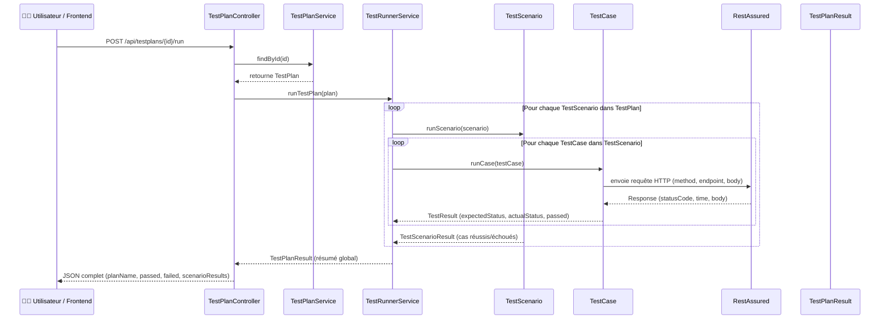
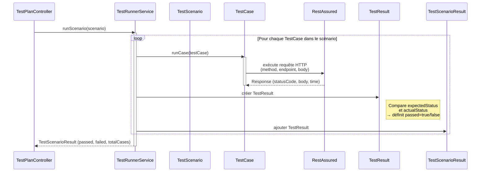
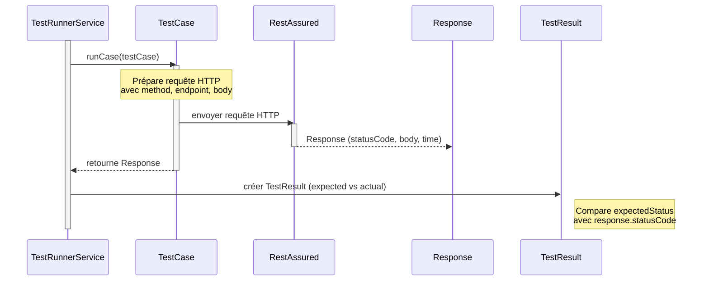
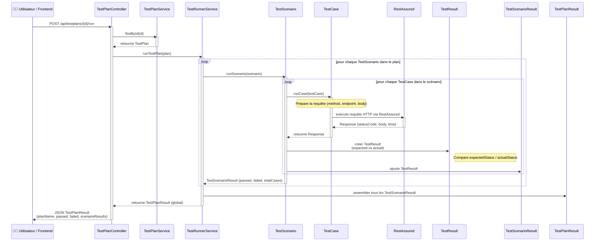

```mermaid
classDiagram
    direction TB

%% ======================== MODELS ===========================
    class TestPlan {
        +Long id
        +String name
        +String description
        +List~TestScenario~ scenarios
    }

    class TestScenario {
        +Long id
        +String name
        +String description
        +List~TestCase~ testCases
    }

    class TestCase {
        +Long id
        +String name
        +String description
        +String method
        +String endpoint
        +String body
        +int expectedStatus
    }

%% ======================== RESULTS ===========================
    class TestPlanResult {
        +String planName
        +int totalScenarios
        +int totalCases
        +int passed
        +int failed
        +List~TestScenarioResult~ scenarioResults
    }

    class TestScenarioResult {
        +String scenarioName
        +int totalCases
        +int passed
        +int failed
        +List~TestResult~ caseResults
    }

    class TestResult {
        +String testCaseName
        +String method
        +String endpoint
        +int expectedStatus
        +int actualStatus
        +boolean passed
        +long responseTimeMs
    }

%% ======================== SERVICES ===========================
    class TestPlanService {
        +findAll()
        +findById(id)
        +save(plan)
        +update(id, plan)
        +deleteById(id)
    }

    class TestScenarioService {
        +findAll()
        +findById(id)
        +save(scenario)
        +update(id, scenario)
        +deleteById(id)
    }

    class TestCaseSe
```

| Étape                             | Description                                                                                      |
| --------------------------------- | ------------------------------------------------------------------------------------------------ |
| **1. Requête utilisateur**        | L’utilisateur (via Swagger, Postman ou UI) appelle `POST /api/testplans/1/run`.                  |
| **2. Récupération du plan**       | `TestPlanController` utilise `TestPlanService` pour charger le plan depuis la mémoire (ou base). |
| **3. Exécution du plan**          | Le contrôleur transmet le `TestPlan` à `TestRunnerService.runTestPlan()`.                        |
| **4. Boucle sur les scénarios**   | `TestRunnerService` parcourt chaque `TestScenario` du plan.                                      |
| **5. Boucle sur les cas de test** | Pour chaque `TestCase`, il exécute `runCase()`.                                                  |
| **6. Exécution HTTP réelle**      | `RestAssured` envoie la requête REST (ex: `POST /auth/login`) et renvoie le `Response`.          |
| **7. Comparaison et validation**  | `TestRunnerService` compare `expectedStatus` et `actualStatus` → crée un `TestResult`.           |
| **8. Construction du rapport**    | Après tous les cas → création d’un `TestScenarioResult`, puis d’un `TestPlanResult`.             |
| **9. Retour du résultat**         | `TestPlanController` renvoie au client un JSON hiérarchique des résultats.                       |

| Étape                               | Description                                                                                            |
| ----------------------------------- | ------------------------------------------------------------------------------------------------------ |
| **1. Appel `runScenario()`**        | Le contrôleur ou `TestRunnerService` appelle la méthode pour exécuter un seul scénario.                |
| **2. Boucle sur les cas de test**   | Pour chaque `TestCase` contenu dans le scénario…                                                       |
| **3. Envoi de la requête HTTP**     | `RestAssured` construit la requête (`method`, `endpoint`, `body`) et l’envoie vers l’API cible.        |
| **4. Réception de la réponse**      | `RestAssured` retourne un objet `Response` (code, corps, temps d’exécution).                           |
| **5. Validation**                   | Le service compare le `expectedStatus` et le `actualStatus`, calcule `passed` (true/false).            |
| **6. Construction du `TestResult`** | Chaque résultat individuel est enregistré.                                                             |
| **7. Agrégation**                   | Les résultats sont regroupés dans un `TestScenarioResult` contenant le nombre de tests passés/échoués. |
| **8. Retour au contrôleur**         | `runScenario()` retourne le résultat complet du scénario.                                              |

| Niveau             | Élément                                        | Description                                                                              |
| ------------------ | ---------------------------------------------- | ---------------------------------------------------------------------------------------- |
| **1. Plan**        | `TestPlanController` → `TestPlanService`       | Le plan de test est récupéré en mémoire ou BD.                                           |
| **2. Scénarios**   | `TestRunnerService` boucle sur chaque scénario | Chaque scénario représente une suite fonctionnelle (Auth, User, etc.).                   |
| **3. Cas de test** | `RestAssured` exécute chaque requête API       | Chaque `TestCase` définit une requête REST, un code attendu, et produit un `TestResult`. |
| **4. Résultats**   | `TestRunnerService` regroupe les résultats     | Agrégation → `TestScenarioResult` → `TestPlanResult`.                                    |
| **5. Sortie**      | `Controller` renvoie un JSON                   | Résumé complet du plan exécuté, scénarios, cas, et succès/échecs.                        |

💡 What’s new
Change	Description
Static block	Runs once when the class loads; sets RestAssured’s global configuration.
Timeouts	http.connection.timeout, http.socket.timeout, http.connection-manager.timeout all set to 10 000 ms (10 s).
Applies globally	Every RestAssured request (GET, POST, etc.) uses these limits automatically.
Independent of CORS	This is a real network timeout — unrelated to @CrossOrigin(maxAge=3600).